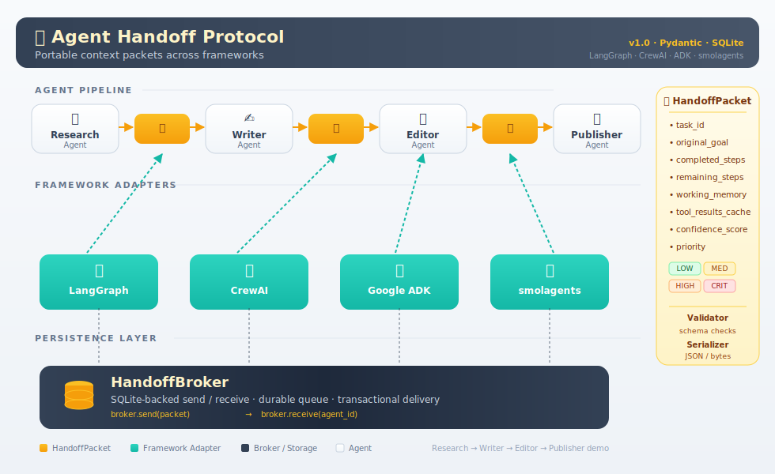

# Agent Handoff Protocol



[](https://badge.fury.io/py/agent-handoff-protocol)
[](https://www.python.org/downloads/)
[](https://opensource.org/licenses/MIT)

A lightweight, framework-agnostic Python library that defines a standard for
passing state between agents in multi-agent systems. It ships with a typed
`HandoffPacket`, a validator, a serializer (JSON / dict / LLM-prompt), adapters
for the four most widely used agent frameworks (LangGraph, CrewAI, Google ADK,
smolagents), and a persistent `HandoffBroker` backed by SQLite.

---

## Overview

When one agent finishes its part of a task and passes control to the next,
everything the next agent needs — context, working memory, partial outputs,
confidence, remaining goals — has to travel with it. This library provides a
single, typed contract for that transfer so multi-agent systems stop
re-inventing it with ad-hoc dictionaries.

Core components:

- `HandoffPacket` — the typed payload (Pydantic model)
- `HandoffValidator` — structural and semantic checks before a send
- `PacketSerializer` — JSON, dict, and LLM-prompt round-tripping
- `HandoffBroker` — SQLite-backed send/receive with routing metadata
- Framework adapters — LangGraph, CrewAI, Google ADK, smolagents

## Problem Statement

Multi-agent systems are now common, but there is no shared standard for what a
handoff contains. Each team invents its own dict shape, loses context between
agents, cannot trace or debug handoffs, and cannot swap frameworks without
rewriting glue code. The Agent Handoff Protocol fixes this by providing:

- A single typed payload that carries everything a receiver needs
- Validation so bad handoffs fail at the sender, not at the receiver
- Serialization formats suitable for storage, wire transfer, and LLM prompts
- Adapters so the same packet can be dropped into any supported framework
- A broker so agents in a running system can hand off asynchronously

## HandoffPacket Field Reference

| Field | Type | Required | Default | Description |
|---|---|---|---|---|
| `task_id` | `str` | yes | — | Unique identifier for this task |
| `original_goal` | `str` | yes | — | The original goal / objective |
| `completed_steps` | `list[CompletedStep]` | no | `[]` | Steps already completed |
| `remaining_steps` | `list[str]` | no | `[]` | Steps still to do |
| `working_memory` | `dict[str, Any]` | no | `{}` | Key-value facts for the next agent |
| `tool_results_cache` | `dict[str, Any]` | no | `{}` | Cached tool results keyed by `tool_call_id` |
| `confidence_score` | `float` (0-1) | no | `1.0` | Sender's confidence in its outputs |
| `handoff_reason` | `str` | no | `""` | Why control is being handed off |
| `context_summary` | `str` | no | `""` | 3-5 sentence summary of progress |
| `priority` | `Priority` | no | `MEDIUM` | One of `LOW`, `MEDIUM`, `HIGH`, `CRITICAL` |
| `created_at` | `str` (ISO) | auto | now | Creation timestamp |
| `updated_at` | `str` (ISO) | auto | `None` | Last update timestamp |
| `ttl_seconds` | `int` | no | `None` | Time-to-live; auto-fills `expires_at` |
| `expires_at` | `datetime` | no | `None` | Absolute UTC expiry |

`CompletedStep`:

```python
{
    "step_name": str,
    "output":    str,
    "timestamp": str,   # ISO-8601
    "agent_name": str,
}
```

## Installation

```bash
pip install agent-handoff-protocol
```

From source:

```bash
git clone https://github.com/dakshjain-1616/agent-handoff-protocol.git
cd agent-handoff-protocol
python3 -m venv venv && source venv/bin/activate
pip install -e .
pip install pytest
pytest
```

Optional framework extras:

```bash
pip install "agent-handoff-protocol[langgraph]"
pip install "agent-handoff-protocol[crewai]"
pip install "agent-handoff-protocol[adk]"
pip install "agent-handoff-protocol[smolagents]"
pip install "agent-handoff-protocol[all]"
```

## Example

```python
from agent_handoff_protocol import (
    HandoffPacket, Priority,
    HandoffValidator, PacketSerializer, HandoffBroker,
)

packet = HandoffPacket(
    task_id="blog_001",
    original_goal="Write a blog post about multi-agent systems",
    priority=Priority.HIGH,
    confidence_score=0.92,
    context_summary="Research complete. Draft outline prepared. Handing off to Writer.",
    handoff_reason="Research phase done; drafting is Writer's responsibility.",
    remaining_steps=["draft", "edit", "publish"],
    working_memory={"sources": ["arxiv.org", "openai.com"]},
)
packet.add_completed_step("research", "Collected 12 sources", agent_name="ResearchAgent")

# Validate before sending
result = HandoffValidator().validate(packet)
assert result.is_valid, result.errors

# Serialize for an LLM prompt
print(PacketSerializer.to_prompt_format(packet))

# Or persist through the broker
with HandoffBroker(db_path=":memory:") as broker:
    broker.send(packet, from_agent="ResearchAgent", to_agent="WriterAgent")
    received = broker.receive("WriterAgent")
```

See [`demos/demo_full_pipeline.py`](demos/demo_full_pipeline.py) for a full
4-agent Research -> Writer -> Editor -> Publisher pipeline.

## Adapter Usage

Every adapter exposes `to_framework(packet)` / `from_framework(state)` plus a
framework-specific pair (`to_langgraph_state`, `from_crewai_context`, etc.).
Missing fields are filled with sensible defaults.

### LangGraph

```python
from adapters.langgraph_adapter import LangGraphAdapter

adapter = LangGraphAdapter()
state = adapter.to_langgraph_state(packet)          # dict usable as LangGraph state
restored = adapter.from_langgraph_state(state)      # -> HandoffPacket
```

### CrewAI

```python
from adapters.crewai_adapter import CrewAIAdapter

adapter = CrewAIAdapter()
ctx = adapter.to_crewai_context(packet)
description = adapter.create_task_description(packet)   # drop into a Crew Task
restored = adapter.from_crewai_context(ctx)
```

### Google ADK

```python
from adapters.adk_adapter import ADKAdapter

adapter = ADKAdapter()
session_state = adapter.to_adk_session_state(packet)
restored = adapter.from_adk_session_state(session_state)
```

### smolagents

```python
from adapters.smolagents_adapter import SmolagentsAdapter

adapter = SmolagentsAdapter()
task_input = adapter.to_smolagents_task(packet)
prompt = adapter.create_agent_prompt(packet)        # natural-language brief
restored = adapter.from_smolagents_task(task_input)
```

## HandoffBroker API

SQLite-backed persistence with routing, audit, and TTL support. Use
`db_path=":memory:"` for tests, or a file path for durable storage.

| Method | Purpose |
|---|---|
| `send(packet, from_agent, to_agent)` | Persist a packet addressed from one agent to another. Returns the assigned handoff id. |
| `receive(agent_name)` | Return the latest pending packet addressed to `agent_name`, or `None`. Marks it delivered. |
| `receive_with_metadata(agent_name)` | Same as `receive`, plus routing metadata. |
| `receive_all(agent_name)` | Drain every pending packet for an agent. |
| `get_packet_history(task_id=...)` | Full handoff timeline for a task. |
| `get_stats()` / `stats()` | Counts by status: `total`, `pending`, `delivered`, `expired`. |
| `purge_expired()` | Delete expired packets; returns the number removed. |
| `get_audit_log(limit=..., event=...)` | Read the per-operation audit trail. |
| `close()` | Close the underlying SQLite connection (also via `with` block). |

Every operation is recorded in the `audit_log` table and can be pretty-printed
with `handoff-cli audit`.

## 3-Agent Pipeline Diagram

```
┌─────────────────────────────────────────────────────────────────┐
│                    3-Agent Pipeline Flow                        │
├─────────────────────────────────────────────────────────────────┤
│                                                                 │
│  ┌──────────────┐      ┌──────────────┐      ┌──────────────┐   │
│  │   Research   │      │    Writer    │      │    Editor    │   │
│  │    Agent     │─────▶│    Agent     │─────▶│    Agent     │   │
│  └──────────────┘      └──────────────┘      └──────────────┘   │
│         │                     │                     │           │
│    [Research]            [Draft]                [Final]         │
│         │                     │                     │           │
│         ▼                     ▼                     ▼           │
│  ┌───────────────────────────────────────────────────────────┐  │
│  │              HandoffBroker (SQLite)                       │  │
│  │  - Stores all handoffs                                    │  │
│  │  - Tracks routing metadata                                │  │
│  │  - Provides packet history & audit log                    │  │
│  └───────────────────────────────────────────────────────────┘  │
│                                                                 │
└─────────────────────────────────────────────────────────────────┘
```

## Development

```bash
pip install -e ".[dev]"
pytest tests/ -v
python demos/demo_full_pipeline.py
```

## License

MIT. See [LICENSE](LICENSE).
